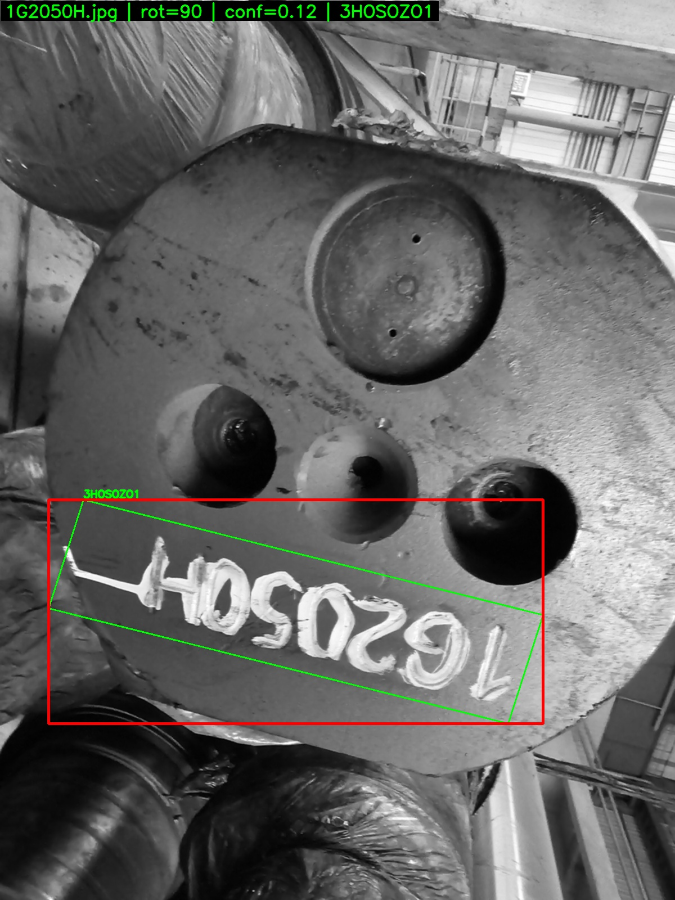
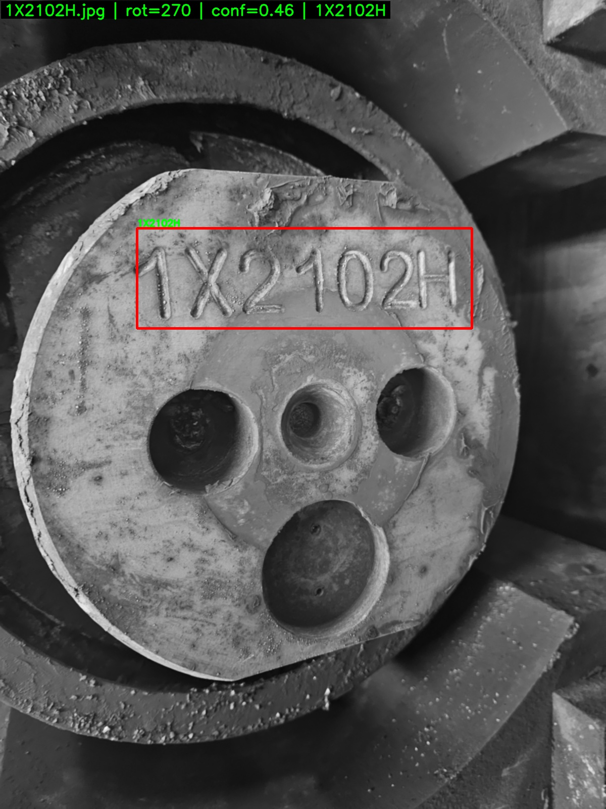
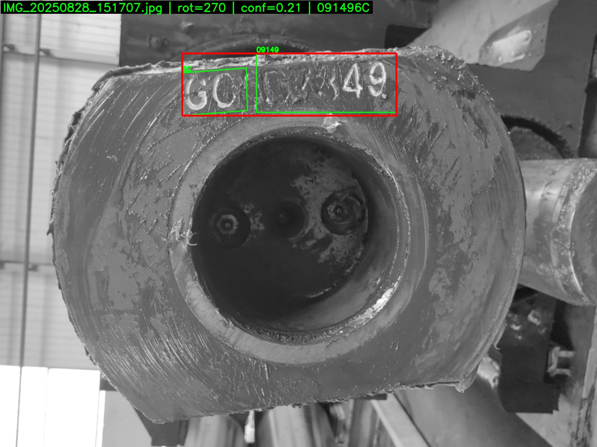
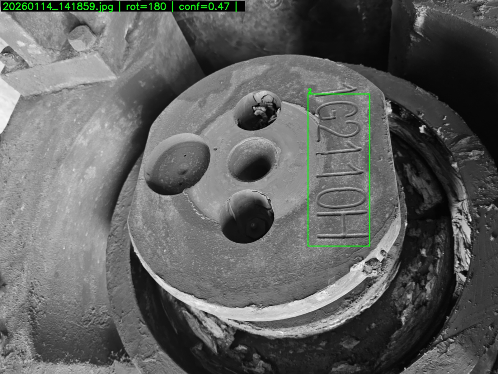

# Industrial-TEXT-OCR

Example outputs (from `output\annotated\`):

<table>
  <tr>
    <td></td>
    <td></td>
  </tr>
  <tr>
    <td></td>
    <td></td>
  </tr>
</table>

Batch OCR for alphanumeric codes from industrial images. Supports 0/90/180/270 rotation search, optional preprocessing, regex-based extraction, CSV output, and annotated review images.

## Directory layout

```
E:\OCR\
  ocr.py
  requirements.txt
  imgs\                # put images here
  output\              # generated: CSV + annotated images
```

## Install

Create or activate your Python environment, then install dependencies:

```
pip install -r requirements.txt
```

Notes:
- `paddleocr` uses PaddlePaddle internally. For GPU, install CUDA-matched `paddlepaddle-gpu` (see GPU section).
- `easyocr` uses PyTorch. For GPU, install CUDA-matched PyTorch.

## Quick start (CPU)

Put images in `imgs\`, then run:

```
python ocr.py -i imgs -o output --save_annotated --save_review
```

Outputs:
- `output\ocr_results.csv`
- `output\annotated\` (all images with boxes + labels)
- `output\review\` (only low-confidence or missing-code images)

## GPU usage

### PaddleOCR (recommended)

1) Install a CUDA-matched PaddlePaddle GPU build.
2) Run with `--use_gpu`:

```
python ocr.py -i imgs -o output --backend paddle --use_gpu --gpu_id 0
```

### EasyOCR

1) Install a CUDA-matched PyTorch.
2) Run with `--use_gpu`:

```
python ocr.py -i imgs -o output --backend easyocr --use_gpu
```

## Parameters

Common options:
- `-i, --input` input image folder (default: `imgs`)
- `-o, --output` output folder (default: `output`)
- `--csv_name` CSV file name (default: `ocr_results.csv`)
- `--min_conf` confidence threshold for manual review (default: `0.75`)
- `--min_len` minimum code length (default: `5`)
- `--regex` custom regex for code extraction (example: `GC[A-Z0-9]{6,10}`)
- `--preprocess` `none` | `mild` | `bin`
- `--max_side` resize max side (default: `1600`)
- `--no_rotate` disable 0/90/180/270 rotation search
- `--save_annotated` save per-image boxes + labels
- `--save_review` save only low-confidence or missing-code images

Backend:
- `--backend paddle` (default)
- `--backend easyocr` (fallback if Paddle fails in your environment)
- `--use_gpu` enable GPU
- `--gpu_id` CUDA device id (default: `0`)

## Output CSV columns

- `file` image file name
- `best_code` best extracted code
- `all_codes` all candidate codes joined by `|`
- `raw_text` concatenated OCR text
- `confidence` average OCR confidence
- `chosen_rotation` selected rotation (0/90/180/270)
- `need_manual_check` boolean flag based on confidence or empty code
- `status` `ok` or `read_fail`

## Annotated images

When `--save_annotated` is enabled:
- Green boxes: all detected text boxes with labels
- Red box: best extracted code region (merged box)
- Header label shows file name, rotation, confidence, and final code

## Troubleshooting

### PaddleOCR PIR/oneDNN errors

If you see errors like:

```
NotImplementedError: ConvertPirAttribute2RuntimeAttribute ...
```

Run with:

```
python ocr.py -i imgs -o output --disable_pir --disable_mkldnn --disable_new_executor
```

### PaddleOCR `cls` argument incompatibility

Some versions do not accept `cls=True`. The script handles this internally.

### Switch to EasyOCR

If PaddleOCR still fails in your environment, switch backend:

```
python ocr.py -i imgs -o output --backend easyocr --save_annotated --save_review
```

## Accuracy tips

- Use `--regex` if your codes follow a fixed pattern.
- Increase `--min_len` if short noise is being extracted.
- Use `--preprocess bin` for clean, high-contrast text.
- Only review the small subset under `output\review\`.

## License

MIT License. See `LICENSE`.
